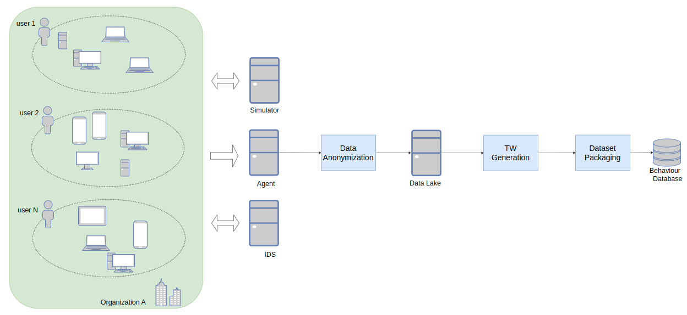

# Risky Behaviour Datasets
Curated selection of behaviour datasets.

This repository contains a selection of behavioral datasets collected using soluble agents and labeled using realistic threat
simulation and IDS rules. The collected datasets are anonymized and aggregated using time window representations.


*Arquitecture Diagram*

## Summary of the Datasets 
The following datasets have been curated:

| DatasetId                              | Behaviour                   | Groundtruth | Users Shape                                      | TW Shape                                                   |
|----------------------------------------|-----------------------------|-------------|------------------------------------------------- |------------------------------------------------------------|
| cryptocurrenty_behaviour               | Miner Checking              | IDS         | - DE: (0: 48, 1: 11) <br/> - SM: (0: 54, 1: 4)   | - DE: (0: 11251, 1: 1343) <br/> - SM: (0: 19334, 1:956)   |
| malware_behaviour                      | Generic Malware Behaviour   | IDS         | - DE: (0: 48, 1: 18) <br/> - SM: (0: 53, 1: 11)  | - DE: (0: 11251, 1: 2458) <br/> - SM: (0: 18993, 1:2930)   |
| outdatedsoftware_flash_behaviour       | Flash Vesion M1             | IDS         | - DE: (0: 48, 1: 56) <br/> - SM: (0: 54, 1: 22)  | - DE: (0: 11251, 1: 10820) <br/> - SM: (0: 19334, 1:6639)  |
| p2p_vuze_behaviour                     | Vuze transfer               | IDS         | - DE: (0: 47, 1: 167) <br/> - SM: (0: 53, 1: 90) | - DE: (0: 11111, 1: 32717) <br/> - SM: (0: 19094 1:17881)  |
| p2p_transfer_behaviour                 | BitTorrent transfer         | IDS         | - DE: (0: 48, 1: 137) <br/> - SM: (0: 53, 1: 48) | - DE: (0: 11111, 1: 18990) <br/> - SM: (0: 19094, 1: 11235)|
| p2p_useragent_behaviour                | Libtorrent user agent       | IDS         | - DE: (0: 47, 1: 92) <br/> - SM: (0: 54, 1: 68)  | - DE: (0: 11251, 1: 26580) <br/> - SM: (0: 19334, 1: 14943)|
| policyviolation_nonecripted_behaviour  | Password detected Behaviour | IDS         | - DE: (0: 48, 1: 291) <br/> - SM: (0: 54, 1: 167)| - DE: (0: 11251, 1: 59943) <br/> - SM: (0: 19334, 1: 41434)|
| phishing_behaviour                     | Amazon Phishing email       | Simulation  | - DE: (0: 32, 1: 19) <br/> - SM: (0: 44, 1: 26)  | - DE: (0: 5104, 1: 3072) <br/> - SM: (0: 12880, 1: 8968)   |

*DE*: refers to Desktop and *SM* refers Smartphone

## Methodology  
To collect the dataset, we have deployed multiple agents and soluble agents within an infrastructure with 
more than 3k entities, comprising laptops, workstations, and smartphone devices. The methods to build 
ground truth are as follows:

- Simulator: We launch different realistic phishing campaigns, aiming to expose user credentials or defeat access to a service.
- IDS: We deploy an IDS to collect various alerts associated with behavioral anomalies, such as cryptomining or peer-to-peer traffic.

For each user exposed to the behaviors stated in the summary table, different TW is computed, aggregating 
user behavior within a fixed time interval. This TW serves as the basis for generating various supervised 
and unsupervised methods.

## Time-Window Representation
The time windows (TW) are a data representation based on aggregated logs from multimodal sources between two 
timestamps. In this study, logs from HTTP, DNS, SSL, and SMTP are taken into consideration, allowing the 
construction of rich behavioral profiles. The indicators described in the TE are a set of manually curated 
interpretable features designed to describe device-level properties within the specified time frame. The most 
influential features are described below. 

## Indexing Features
- **User:** A unique hash value that identifies a user.
- **Timestamp:** The timestamp of the windows.
- **Label:**  1 if the user exhibits compromised behavior, 0 otherwise. -1 indicates that it is a TW with an unknown label.

## Time-related Features  
Time windows related to the time in which they occur:

- InterlogTime per Category: Aggregates the time between two consecutive logs. 
- WorkingHour: Whether the TW occurs within working hours. 
- WorkingDay: Whether the TW occurs within working day. 

## Features related to DNS 
The activity generated by application logs related to DNS traffic:

- ProtocolUsed: Protocol used (TCP or DNS).
- PortUsed: Ratio of DNS requests to 5353.
- ReturnCode: Percentage of return codes.

## Features related to HTTP
The application logs generated during the transmission of hypertext:

- RequestMethods: Proportion of different request methods.
- ResponseStatus: Response status of the HTTP event.
- VersionUsed: Events using a specific HTTP version.

## Features related to SSL 
The application logs related to activities using encryption to transmit information:

- VersionRatio: Ratio of the protocol used.
- EstablishedConnection: Ratio of established connections.
- CurveStandard: The type of curve used.

## Features related to SMTP
The application logs related to email activity:

- Inout: Ratio between sent/received emails.
- SubjectRichness: Ratio between words and characters.
- HazardousExtensions: Percentage of emails with hazardous attachments.

# Citation 
If you use the Behaviour Datasets in your scientific publication, we would appreciate citations to the following paper: 

```
@INPROCEEDINGS{10302480,
  author={Calvo, Albert and Escuder, Santiago and Escrig, Josep and Arias, Marta and Ortiz, Nil and Guijarro, Jordi},
  booktitle={2023 IEEE 10th International Conference on Data Science and Advanced Analytics (DSAA)}, 
  title={A Data-driven Approach for Risk Exposure Analysis in Enterprise Security}, 
  year={2023},
  pages={1-9},
  doi={10.1109/DSAA60987.2023.10302480}}
```
